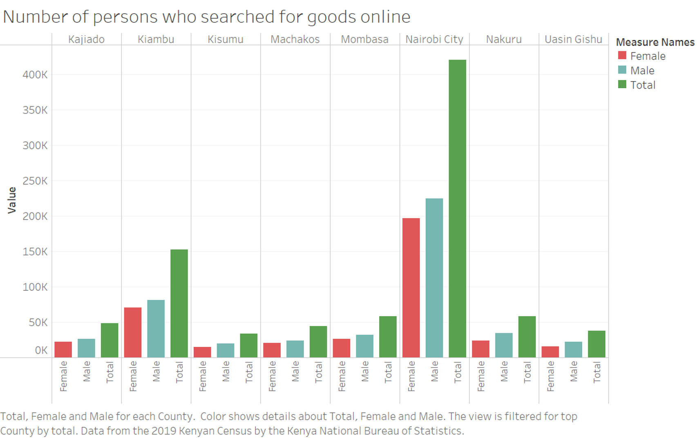

# Google Data Analytics Capstone - Insights from the 2019 Kenyan Census

## Introduction

This is a project I did as part of the Google Data Analytics Professional Certificate in 2021. The data used was first published in the #TidyTuesday series of datasets that are published on GitHub and used by the R community to showcase various visualization techniques.

The data is obtained from the `rKenyaCensus` package courtesy of [Shelmith Kariuki](https://github.com/Shelmith-Kariuki).
`rKenyaCensus` is an R package that contains the 2019 Kenya Population and Housing Census results. The results were released by the Kenya National Bureau of Statistics in February 2020, and published in four different pdf files (Volume 1 - Volume 4).

The 2019 Kenya Population and Housing Census was the eighth to be conducted in Kenya since 1948 and was conducted from the night of 24th/25th to 31st August 2019. Kenya leveraged on technology to capture data during cartographic mapping, enumeration and data transmission, making the 2019 Census the first paperless census to be conducted in Kenya.

This project is a showcase of the steps of data analysis process where we start from raw data to actionable insights. The process involves setting a problem statement, business use case, goals and metrics then finally show how the data has answered the question. The main tool of analysis is R, but I will also use Excel and Tableau depending on the analysis or visualization required. You can find more details about the data used [here](https://github.com/rfordatascience/tidytuesday/blob/master/data/2021/2021-01-19/readme.md)

### Summary of the Problem
|        |        |
| ------ | :----- |
| **Title** | Online searches for goods grouped by counties in Kenya  |
| **Industry of focus** | E-commerce  |
| **Problem statement** | Which counties in Kenya contributed to most online customers in 2019? |
| **Business use case** | How can e-commerce companies identify emerging markets and expand marketing to those counties? |
| **Goals & Metrics** | Correlation, Significance tests, Visualizations |
| **Deliverables** | A solution and suggestion that can help businesses in these markets |
| **Datasets available** | Yes |
| **Datasets list** | Data obtained from the rKenyaCensus package and based on the 2019 Kenyan Census. |

