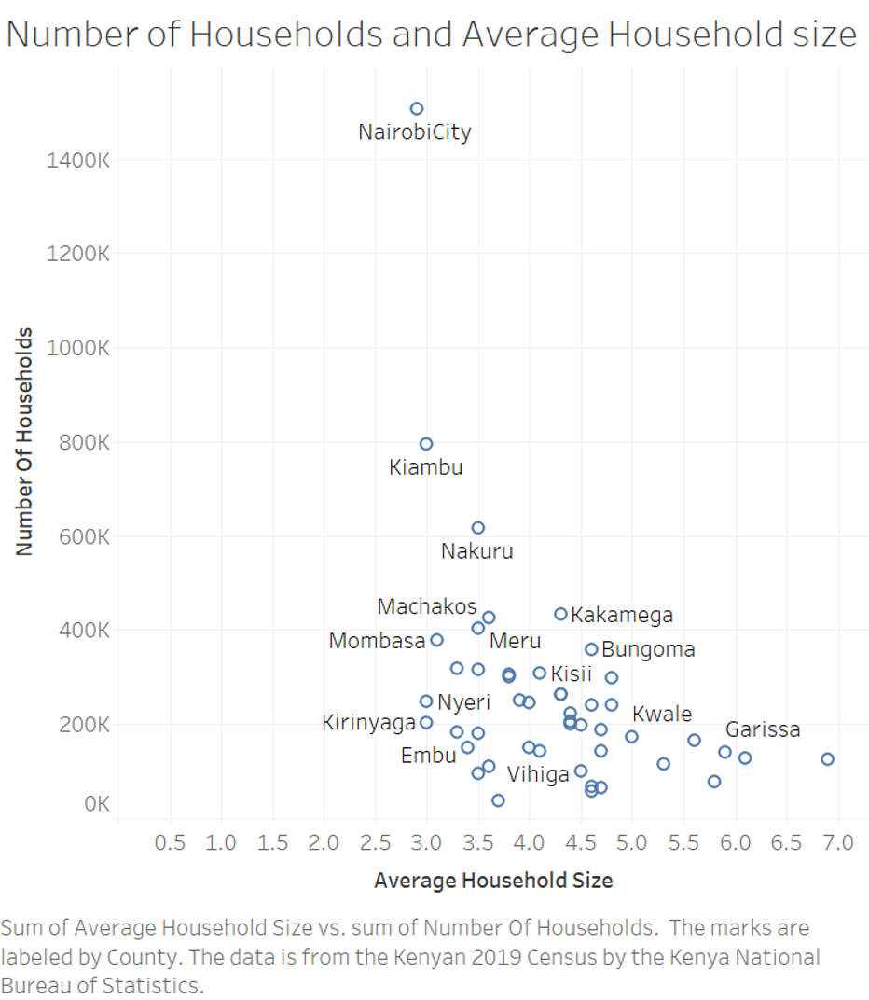
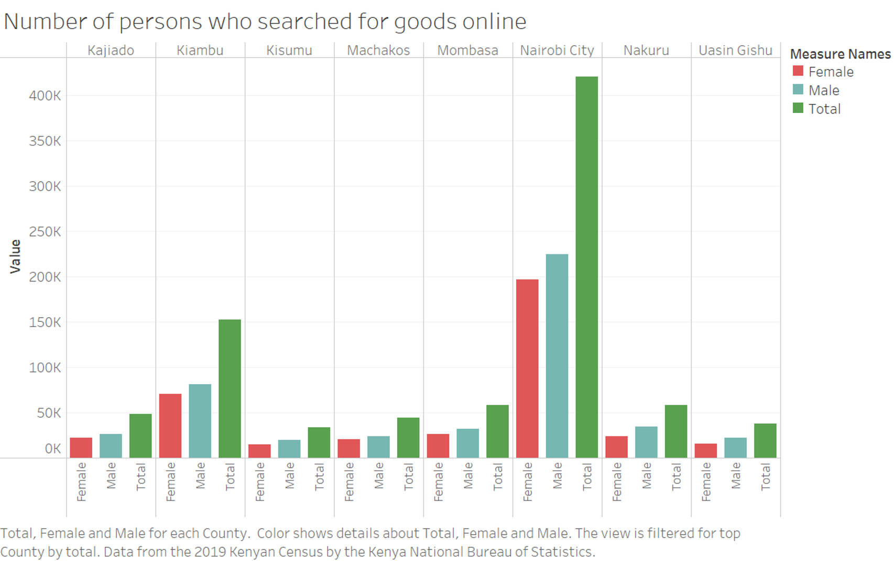
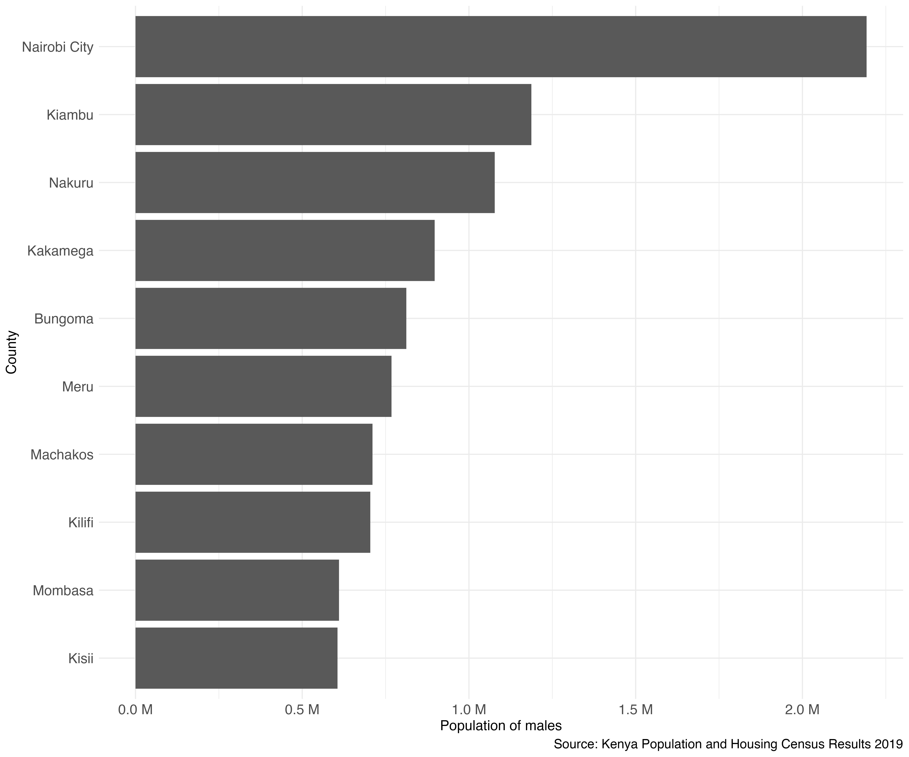
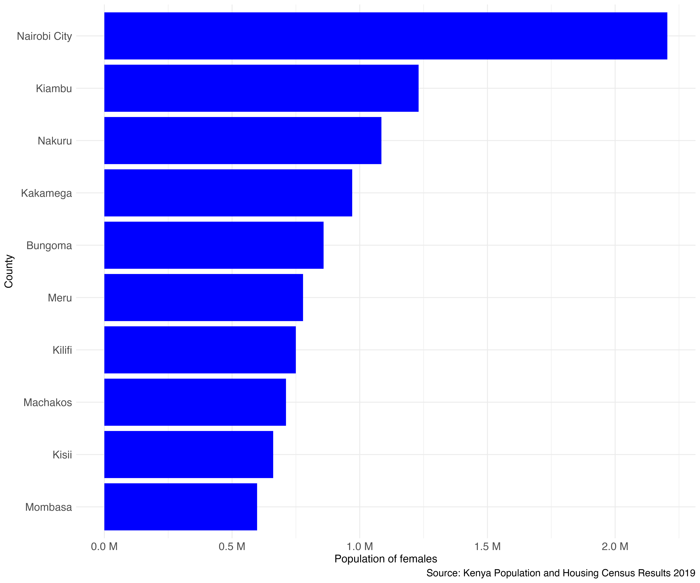
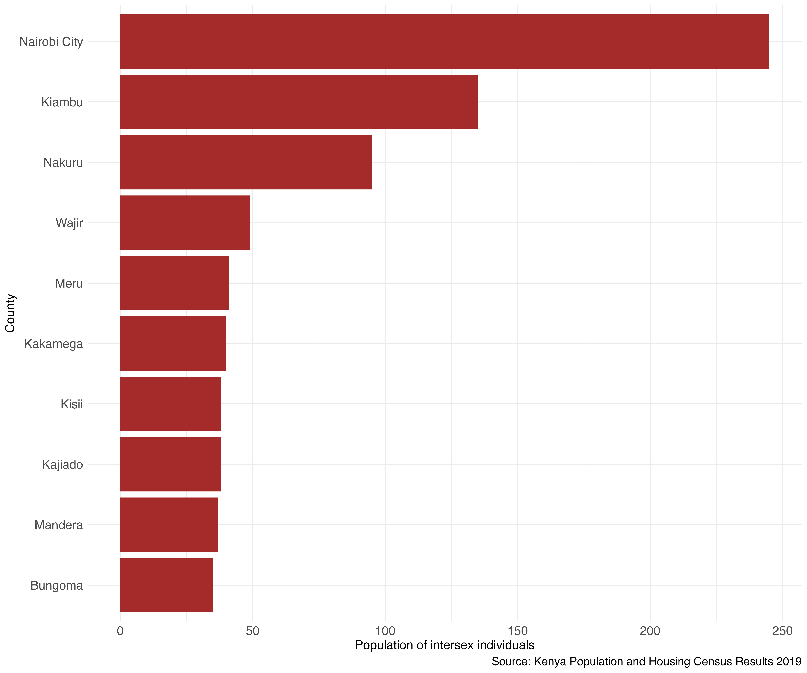

# Google Data Analytics Capstone - Insights from the 2019 Kenyan Census

## Introduction

This is part of a project I did for the Google Data Analytics Professional Certificate in 2021. The data used was first published in the #TidyTuesday series of datasets that are published on GitHub and used by the R community to showcase various visualization techniques.

The data is obtained from the `rKenyaCensus` package courtesy of [Shelmith Kariuki](https://github.com/Shelmith-Kariuki).
`rKenyaCensus` is an R package that contains the 2019 Kenya Population and Housing Census results. The results were released by the Kenya National Bureau of Statistics in February 2020, and published in four different pdf files (Volume 1 - Volume 4).

The 2019 Kenya Population and Housing Census was the eighth to be conducted in Kenya since 1948 and was conducted from the night of 24th/25th to 31st August 2019. Kenya leveraged on technology to capture data during cartographic mapping, enumeration and data transmission, making the 2019 Census the first paperless census to be conducted in Kenya.

This project is a showcase of the steps of data analysis process where we start from raw data to actionable insights. The process involves setting a problem statement, business use case, goals and metrics then finally show how the data has answered the question. The main tool of analysis is R, but I will also use Excel and Tableau depending on the analysis or visualization required. You can find more details about the data used [here](https://github.com/rfordatascience/tidytuesday/blob/master/data/2021/2021-01-19/readme.md)

Figure 1: Number of households vs household sizes

### Summary of the Problem
|        |        |
| ------ | :----- |
| **Title** | Online searches for goods grouped by counties in Kenya  |
| **Industry of focus** | E-commerce  |
| **Problem statement** | Which counties in Kenya contributed to most online customers in 2019? |
| **Business use case** | How can e-commerce companies identify emerging markets and expand marketing to those counties? |
| **Goals & Metrics** | Correlation, Significance tests, Visualizations |
| **Deliverables** | A solution and suggestion that can help businesses in these markets |
| **Datasets available** | Yes |
| **Datasets list** | Data obtained from the rKenyaCensus package and based on the 2019 Kenyan Census. |

# Methodology

The methodology section of this work describes the tools and processes used to analyze and visualize data related to the 2019 census results in Kenya. The data analysis was conducted using the R programming language in R Studio Desktop, while data visualization was performed using Tableau and QGIS software.

For data wrangling and munging, the tidyverse package was used in R, while various packages including tmap, rgdal, sp, sf, and raster were used for data visualization. These packages were essential for creating maps that provided detailed information about the areas in focus. In addition, QGIS software was also used to create additional maps to provide a better understanding of the study area.

Finally, an interactive dashboard was created using Shiny, which allowed users to play with the data and get specific summaries about a location in Kenya based on the 2019 census. This dashboard provided an interactive process that allowed users to easily explore and understand the census results. The results of the analysis and the code were committed to GitHub for sharing and collaboration.

# Results

## Quick Summaries
### Male population by counties

Here, I list the top 10 counties in terms of the male population:

Figure 3: Ten counties with the highest number of male population

The counties with the highest male population were Nairobi, Kiambu, Nakuru, Kakamega, Bungoma, Meru, Machakos, Kilifi, Mombasa, Kisii.

### Female population by counties

Here, I list the top 10 counties in terms of the female population:

Figure 4: Ten counties with the highest number of female population

The counties with the highest female population were Nairobi, Kiambu, Nakuru, Kakamega, Bungoma, Meru, Kilifi, Machakos, Kisii, Mombasa.

### Intersex population by counties

This section lists the top 10 counties in terms of the intersex population.

Figure 5: Ten counties with the highest number of intersex population

### Some things to consider

**Population**

- Siaya, Busia and HomaBay had the highest female: male ratio meaning more female population than that of males.

- Garissa, Wajir, Lamu and Marsabit had the lowest female: male ratio meaning there was a higher male population than that of females.

- The top 10 counties by population are Nairobi, Kiambu, Nakuru, Kakamega, Bungoma, Meru, Kilifi, Machakos, Kisii and Mombasa.

- The bottom ten counties by population are Lamu, Isiolo, Samburu, Tana River, Taita Taveta, Tharaka Nithi, Marsabit, Elgeyo-Marakwet, Laikipia and Vihiga.

**Household Size**

- The top ten counties by average household size were Mandera (6.9), Wajir (6.1), Garissa (5.9), Marsabit (5.8), Turkana (5.6), West Pokot (5.3), Kwale (5.0), Kilifi (4.8), Narok (4.8), Samburu (4.7).

- The bottom 10 counties by average household size were Nairobi (2.9), Nyeri (3.0), Kirinyaga (3.0), Kiambu (3.0), Mombasa (3.1), Embu (3.3), Murang'a (3.3), Laikipia (3.4), Taita Taveta (3.5) and Machakos (3.5).

- There is a weak negative correlation (-0.29) between county population and the average household size.

- The mean number of households for the counties with the highest household sizes is 428,180. We see that counties with high average household size have fewer households overall.

- We see that counties with high average household size have fewer households (153,197) overall.

**Births**

- The counties with the most number of births in the past 5 years referenced 2019 were Nairobi, Kiambu, Nakuru, Kakamega, Bungoma, Meru, Kilifi, Mombasa, Narok and Kajiado.

- The counties with the least number of total births in the past 5 years referenced 2019 were Lamu, Isiolo, Samburu, Taita Taveta, Tana River, Tharaka Nith, Marsabit, Elgeyo Marakwet, vihiga and Laikipia.

- The counties with the least number of notified births were Wajir, Mandera, West Pokot, Marsabit, Turkana, Samburu, Garissa, Tana River, Isiolo and Narok.

- 

